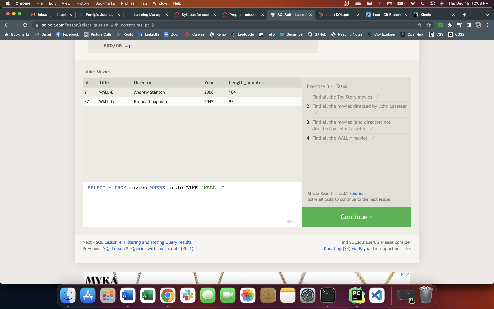
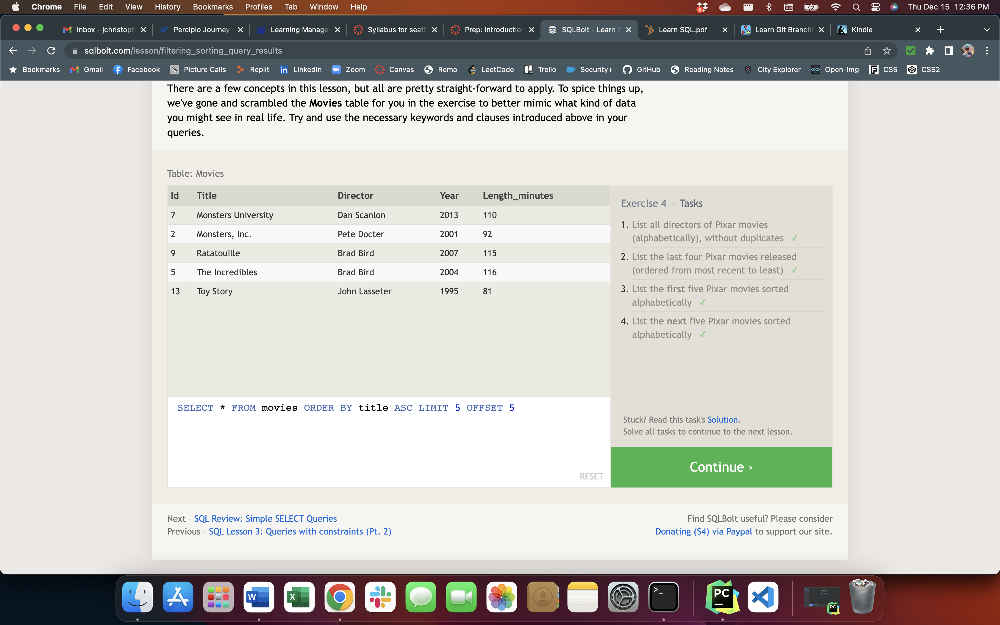

# SQL Practice

## Lesson 1

* Used SELECT and FROM to search for one or multiple columns in a table.  

## Lesson 2

* Used WHERE to set a conditional statement.  

## Lesson 3

* Used WHERE with different operators like `=`, `LIKE`, `%`, `_`, and `IN`.  

## Lesson 4

* Used DISTINCT, ORDER BY (with ASC & DESC), LIMIT, and OFFSET to display desired items.  

## Lesson 5

* An extension of Lesson 4 using conditional statements as well.  

## Lesson 6

* Joined multiple tables using INNER JOIN and ON.  

## Lesson 13

* Manipulated a table by inserting items using INSERT INTO and VALUES.

## Lesson 14

* Updated a table by changing items using UPDATE and SET.

## Lesson 15

* Deleted items in a table using DELETE FROM and WHERE.

## Lesson 16

* Created a table and provided a schema using CREATE TABLE and specifying column names and data types such as INTEGER, TEXT, FLOAT, and BOOLEAN.

## Lesson 17

* Added and deleted columns from table using ALTER TABLE and ADD (with name and data type) or DELETE (with WHERE).

## Lesson 18

* Deleted a table using DROP TABLE IF EXISTS.

